```mermaid
graph LR
    A[YAML Spec File] --> B[1. Sampler<br/>Latin Hypercube]
    B --> C[Parameter Sets]
    C --> D[2. Template Engine<br/>Jinja2]
    D --> E[3. LLM Pipeline<br/>Executor]
    E --> F[LLM Outputs]
    F --> G[4. Oracle Judges<br/>LLM/Custom]
    G --> H[Raw Scores]
    H --> I[5. Bayesian Analyzer<br/>PyMC MCMC]
    I --> J[Statistical Report<br/>JSON + HDI]

    style A fill:#e1f5ff
    style B fill:#fff4e1
    style C fill:#fff4e1
    style D fill:#e8f5e9
    style E fill:#e8f5e9
    style F fill:#e8f5e9
    style G fill:#f3e5f5
    style H fill:#f3e5f5
    style I fill:#fce4ec
    style J fill:#fce4ec
```

# MetaReason Core

MetaReason Core is an open source tool for **statistically rigorous quantitative measurement** of LLM and agentic AI systems.

## Key Differentiator

MetaReason enables you to make statements like:

> **"We are 94% confident the true quality is between 4.65 and 5.10"**

Using Bayesian inference with PyMC, MetaReason provides:
- **High-Density Credible Intervals** for quality estimates
- **Proper uncertainty quantification** accounting for oracle variability
- **Population-level assessment** across parameter variants
- **Statistical rigor** for confident decision-making

## The Problem with Standard LLM Evals

Most LLM evaluation tools provide a **single-point score**, like "Average Quality: 4.2."

This leaves decision-makers **flying blind** with critical, unanswerable questions:

- ❓ Is a score of 4.2 statistically different from 4.1?
- ❓ How confident are we in this number? Is the true quality somewhere between 4.0 and 4.4, or is it between 2.0 and 6.0?
- ❓ How much of our result is just random noise from our "AI Judge" or human evaluator?
- ❓ Can we confidently ship a new model or manage AI risk on a single, noisy number?

**You can't.** MetaReason is built to solve this.

## How It Works: Architecture Overview



**Pipeline Flow:**
1. **YAML Spec** defines evaluation parameters, sampling strategy, and oracles
2. **Latin Hypercube Sampler** generates space-filling parameter combinations
3. **Jinja2 Templates** render prompts with sampled parameters
4. **LLM Executor** runs the pipeline (supports multi-stage, async)
5. **Oracle Judges** evaluate outputs (LLM judges, regex, custom metrics)
6. **Bayesian Analyzer** performs MCMC sampling to estimate true quality with uncertainty
7. **Statistical Report** provides HDI intervals and diagnostic metrics

## 🚀 Quick Start

### Installation

```bash
# Clone the repository
git clone https://github.com/metareason-ai/metareason-core.git
cd metareason-core

# Create and activate virtual environment
python -m venv venv
source venv/bin/activate  # On Windows: venv\Scripts\activate

# Install in development mode
pip install -e ".[dev]"
```

### Basic Usage

1. **Validate a specification file**:
```bash
metareason validate examples/quantum_entanglement_eval.yml
```

2. **Run an evaluation with Bayesian analysis**:
```bash
metareason run examples/quantum_entanglement_eval.yml --analyze
```

This will:
- Generate parameter samples using Latin Hypercube Sampling
- Execute the LLM pipeline with each sample
- Evaluate outputs using configured oracles
- **Perform Bayesian analysis with statistically rigorous credible intervals**
- Save results to `reports/` directory

3. **Analyze previously saved results**:
```bash
metareason analyze reports/my_results.json --spec examples/quantum_entanglement_eval.yml
```

4. **Generate an HTML report**:
```bash
metareason report reports/my_results.json --spec examples/quantum_entanglement_eval.yml
```

5. **View results**:
Results are saved as JSON in the `reports/` directory with timestamps. HTML reports are self-contained files with embedded visualizations.

### Bayesian Analysis Output

When using `--analyze`, you'll get statistically rigorous credible intervals:

```
Population Quality: coherence_judge

We are 94% confident the true coherence_judge quality is between 4.65 and 5.10

Population Statistics:
  Mean: 4.88
  94% HDI: [4.65, 5.10]

Oracle Variability: 0.36 (94% HDI: [0.21, 0.54])
Based on 10 evaluations
```

This provides:
- **High-Density Credible Intervals (HDI)**: Statistically rigorous bounds on true quality
- **Population-level estimates**: Overall quality across all parameter variants
- **Oracle variability quantification**: Measurement uncertainty from judge oracles
- **Configurable probability mass**: Default 94%, configurable in spec file

### Example Specification

See [examples/quantum_entanglement_eval.yml](examples/quantum_entanglement_eval.yml) for a complete example demonstrating:
- Multiple sampling distributions (categorical, uniform, normal, truncnorm, beta)
- Jinja2 template rendering with parameter interpolation
- Dual oracle evaluation (coherence + accuracy judges)
- Latin Hypercube Sampling with configurable variants
- Bayesian analysis configuration with MCMC parameters and priors

## Core Features

### ✅ Implemented
- ✅ **Statistically rigorous Bayesian analysis** with PyMC and ArviZ
  - High-Density Credible Intervals (HDI) for quality estimates
  - Population-level quality assessment with uncertainty quantification
  - Oracle variability measurement
  - Configurable probability mass (default 94%)
- ✅ **YAML-based specifications** with Pydantic validation
- ✅ **Jinja2 templating** for prompt generation
- ✅ **Latin Hypercube Sampling** for parameter space exploration
  - Multiple distributions: uniform, normal, truncated normal, beta
  - Categorical and continuous axes
  - Maximin optimization for space-filling designs
- ✅ **LLM Judge oracles** for evaluation
  - JSON-based evaluation with scores and explanations
  - Multiple oracle support
- ✅ **Pipeline-based execution model** (multi-stage, async)
- ✅ **HTML report generation** with embedded visualizations
  - Posterior distribution plots with HDI regions
  - Score distribution histograms
  - Oracle variability plots
  - Parameter space coverage scatter plots
- ✅ **CLI interface** (`run`, `validate`, `analyze`, `report` commands)
- ✅ **LLM adapters** for multiple providers:
  - Ollama (local models)
  - OpenAI (GPT models via Responses API)
  - Google (Gemini models)
  - Anthropic (Claude models via Messages API)

### 🚧 Coming Soon
- 🚧 Parameter effects analysis (Bayesian regression to identify which parameters matter)
- 🚧 Additional oracle types (regex, statistical, custom)
- 🚧 Additional sampling methods

## 🛠️ Development

### Code Quality

The project uses several tools to maintain code quality:

- **Black**: Code formatting
- **isort**: Import sorting
- **flake8**: Linting
- **bandit**: Security checks
- **pytest**: Testing framework

Run all checks manually:
```bash
# Format code
black src tests

# Sort imports
isort src tests

# Run linting
flake8 src tests

# Security checks
bandit -r src

# Run tests
pytest
```

## Troubleshooting

### PyMC / JAX Installation Issues

PyMC depends on PyTensor and optionally JAX. If you see compilation errors:

```bash
# Ensure you have a C compiler available
# macOS: xcode-select --install
# Ubuntu: sudo apt install build-essential

# If PyMC install fails, try upgrading pip first
pip install --upgrade pip setuptools wheel
pip install -e ".[dev]"
```

On Apple Silicon (M1/M2/M3), PyMC works natively. If you see JAX-related warnings, they are typically informational and do not affect functionality.

### Ollama Connection Issues

If using the Ollama adapter and getting connection errors:

```bash
# Verify Ollama is running
curl http://localhost:11434/api/tags

# If not running, start it
ollama serve

# Verify your model is available
ollama list
```

The default Ollama endpoint is `http://localhost:11434`. To use a different host, set it in your adapter config.

### API Key Configuration

For cloud LLM providers, set API keys as environment variables or in a `.env` file:

```bash
# OpenAI
export OPENAI_API_KEY="sk-..."

# Anthropic
export ANTHROPIC_API_KEY="sk-ant-..."

# Google (Developer API)
export GOOGLE_API_KEY="..."

# Or add to .env file in the project root (loaded automatically)
echo 'OPENAI_API_KEY=sk-...' >> .env
```

### Common YAML Spec Errors

Use `metareason validate` to check your spec file before running:

```bash
metareason validate my_spec.yml
```

Common issues:
- **Empty pipeline or oracles**: Both `pipeline` and `oracles` must have at least one entry
- **Missing adapter name**: Each pipeline stage needs an `adapter.name` field
- **Invalid distribution**: Continuous axes support `uniform`, `normal`, `truncnorm`, and `beta`
- **Temperature out of range**: Must be between 0.0 and 2.0

## 🤝 Contributing

We welcome contributions! See [CONTRIBUTING.md](CONTRIBUTING.md) for the full development workflow, code style guide, testing requirements, and PR process.

## 📜 License

Copyright (c) 2025 MetaReason LLC

Licensed under the MIT License. See the [LICENSE](LICENSE) file for details.
