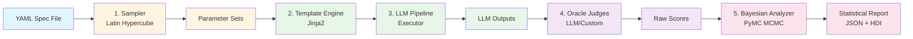

# MetaReason Core

Statistically rigorous evaluation of LLM and agentic AI systems, built on Bayesian inference.

MetaReason replaces single-point eval scores with calibrated uncertainty estimates:

> "We are 94% confident the true quality is between 4.65 and 5.10"

Standard LLM evaluation tools produce a single number — "Average Quality: 4.2" — with no indication of whether that differs meaningfully from 4.1, how much noise the judge introduced, or whether the estimate is precise to within 0.2 or 2.0. MetaReason uses PyMC to fit hierarchical Bayesian models over evaluation results, producing High-Density Credible Intervals that quantify exactly how much you know and how much you don't.

## Architecture


```mermaid
graph LR
    A[YAML Spec File] --> B[1. Sampler<br/>Latin Hypercube]
    B --> C[Parameter Sets]
    C --> D[2. Template Engine<br/>Jinja2]
    D --> E[3. LLM Pipeline<br/>Executor]
    E --> F[LLM Outputs]
    F --> G[4. Oracle Judges<br/>LLM/Custom]
    G --> H[Raw Scores]
    H --> I[5. Bayesian Analyzer<br/>PyMC MCMC]
    I --> J[Statistical Report<br/>JSON + HDI]

    style A fill:#e1f5ff
    style B fill:#fff4e1
    style C fill:#fff4e1
    style D fill:#e8f5e9
    style E fill:#e8f5e9
    style F fill:#e8f5e9
    style G fill:#f3e5f5
    style H fill:#f3e5f5
    style I fill:#fce4ec
    style J fill:#fce4ec
```

1. **YAML Spec** — defines evaluation parameters, sampling strategy, and oracles
2. **Latin Hypercube Sampler** — generates space-filling parameter combinations
3. **Jinja2 Templates** — renders prompts with sampled parameters
4. **LLM Executor** — runs the pipeline (multi-stage, async)
5. **Oracle Judges** — evaluates outputs (LLM judges, regex, custom metrics)
6. **Bayesian Analyzer** — performs MCMC sampling to estimate true quality with uncertainty
7. **Statistical Report** — provides HDI intervals and diagnostic metrics

## Quick Start

### Installation

```bash
git clone https://github.com/metareason-ai/metareason-core.git
cd metareason-core

python -m venv venv
source venv/bin/activate  # On Windows: venv\Scripts\activate

pip install -e ".[dev]"
```

### Usage

Validate a spec file:
```bash
metareason validate examples/quantum_entanglement_eval.yml
```

Run an evaluation with Bayesian analysis:
```bash
metareason run examples/quantum_entanglement_eval.yml --analyze
```

Analyze previously saved results:
```bash
metareason analyze reports/my_results.json --spec examples/quantum_entanglement_eval.yml
```

Generate an HTML report:
```bash
metareason report reports/my_results.json --spec examples/quantum_entanglement_eval.yml
```

Results are saved as JSON in `reports/` with timestamps. HTML reports are self-contained with embedded visualizations.

### Example Output

With `--analyze`, the output includes calibrated credible intervals:

```
Population Quality: coherence_judge

We are 94% confident the true coherence_judge quality is between 4.65 and 5.10

Population Statistics:
  Mean: 4.88
  94% HDI: [4.65, 5.10]

Oracle Variability: 0.36 (94% HDI: [0.21, 0.54])
Based on 10 evaluations
```

## Features

**Bayesian analysis** — PyMC hierarchical models with High-Density Credible Intervals, population-level quality estimates, oracle variability measurement, and configurable probability mass (default 94%)

**YAML-based specifications** — Pydantic-validated configs defining the full evaluation pipeline

**Latin Hypercube Sampling** — space-filling experimental designs with uniform, normal, truncated normal, beta, and categorical distributions; maximin optimization

**Multi-stage pipelines** — async execution with Jinja2 templating; each stage chains to the next

**Oracle evaluation** — LLM-as-judge (JSON score + explanation) and regex-based pattern matching with linear score interpolation

**LLM adapters** — Ollama, OpenAI, Google (Gemini), and Anthropic (Claude)

**Auto-calibration** — iterative rubric optimization for judge oracles with convergence checking

**HTML reports** — self-contained reports with posterior distributions, score histograms, oracle variability plots, and parameter space coverage

**CLI** — `run`, `validate`, `analyze`, `report`, `calibrate`, `calibrate-multi`

### Roadmap

- Parameter effects analysis via Bayesian regression
- Additional sampling methods

## Development

The project enforces code quality via pre-commit hooks: **black** (formatting), **isort** (imports), **flake8** (linting), **bandit** (security), and **commitizen** (conventional commits).

```bash
black src tests && isort src tests   # format
flake8 src tests                     # lint
bandit -r src                        # security
pytest                               # test (80% coverage enforced)
```

See [CONTRIBUTING.md](CONTRIBUTING.md) for the full development workflow, branching conventions, and PR process.

## Troubleshooting

### PyMC / JAX Installation

PyMC depends on PyTensor and optionally JAX. If you hit compilation errors:

```bash
# macOS: xcode-select --install
# Ubuntu: sudo apt install build-essential

pip install --upgrade pip setuptools wheel
pip install -e ".[dev]"
```

On Apple Silicon, PyMC works natively. JAX-related warnings are informational and do not affect functionality.

### Ollama Connection

```bash
curl http://localhost:11434/api/tags   # verify Ollama is running
ollama serve                           # start if needed
ollama list                            # check available models
```

Default endpoint: `http://localhost:11434`. Override via adapter config.

### API Keys

Set provider keys as environment variables or in a `.env` file (loaded automatically):

```bash
export OPENAI_API_KEY="sk-..."
export ANTHROPIC_API_KEY="sk-ant-..."
export GOOGLE_API_KEY="..."
```

### Common Spec Errors

Run `metareason validate my_spec.yml` before execution. Common issues:

- `pipeline` and `oracles` must each have at least one entry
- Each pipeline stage requires an `adapter.name` field
- Continuous axes support `uniform`, `normal`, `truncnorm`, and `beta`
- Temperature must be between 0.0 and 2.0

## Contributing

See [CONTRIBUTING.md](CONTRIBUTING.md).

## License

Copyright (c) 2025 MetaReason LLC. Licensed under the MIT License — see [LICENSE](LICENSE).
