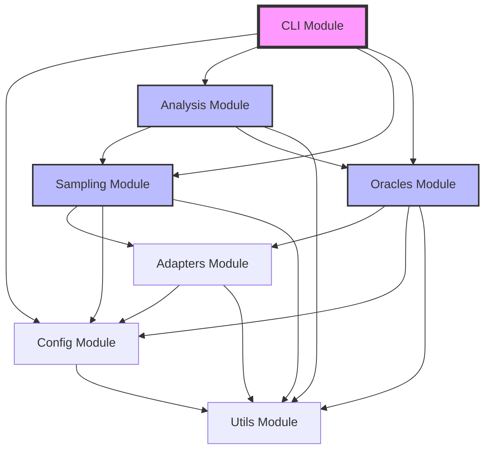
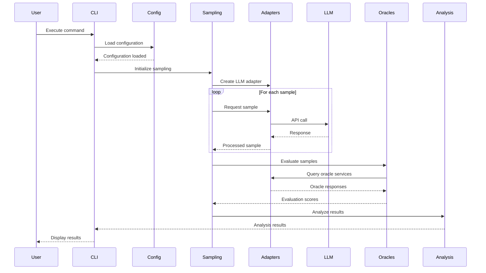

# MetaReason Architecture Documentation

## Overview

MetaReason is a meta-reasoning framework designed for LLM sampling and oracle evaluation. This document outlines the core architecture, module dependencies, data flow, and extension mechanisms.

## Module Dependency Diagram



## Core Modules

### 1. CLI Module (`metareason.cli`)
- **Purpose**: Command-line interface for the framework
- **Dependencies**: Click framework
- **Key Components**:
  - Main entry point
  - Command parsers
  - Output formatters

### 2. Config Module (`metareason.config`)
- **Purpose**: Configuration management and validation
- **Dependencies**: Pydantic, PyYAML
- **Key Components**:
  - Configuration schemas
  - Settings validation
  - Environment variable handling

### 3. Analysis Module (`metareason.analysis`)
- **Purpose**: Statistical analysis and Bayesian inference
- **Dependencies**: PyMC, NumPy, SciPy, Pandas
- **Key Components**:
  - Bayesian models
  - Statistical utilities
  - Result analyzers

### 4. Sampling Module (`metareason.sampling`)
- **Purpose**: LLM sampling strategies and management
- **Dependencies**: Adapters, Configuration
- **Key Components**:
  - Sampling strategies
  - Batch processors
  - Sample collectors

### 5. Oracles Module (`metareason.oracles`)
- **Purpose**: Oracle evaluation and scoring
- **Dependencies**: Adapters, Configuration
- **Key Components**:
  - Oracle interfaces
  - Evaluation metrics
  - Score aggregators

### 6. Adapters Module (`metareason.adapters`)
- **Purpose**: External service integrations
- **Dependencies**: httpx, aiohttp
- **Key Components**:
  - LLM provider adapters
  - API clients
  - Protocol implementations

### 7. Utils Module (`metareason.utils`)
- **Purpose**: Shared utilities and helpers
- **Dependencies**: Core Python libraries
- **Key Components**:
  - Logging utilities
  - Retry mechanisms
  - Common helpers

## Data Flow Architecture



## Plugin Architecture

### Design Principles

1. **Interface-based**: All plugins implement well-defined interfaces
2. **Discoverable**: Plugins are automatically discovered via entry points
3. **Configurable**: Plugin behavior controlled through configuration
4. **Isolated**: Plugins are isolated from core logic

### Plugin Types

#### 1. LLM Adapters
```python
from abc import ABC, abstractmethod
from typing import Dict, Any, AsyncIterator

class LLMAdapter(ABC):
    """Base interface for LLM adapters."""

    @abstractmethod
    async def generate(
        self,
        prompt: str,
        **kwargs: Any
    ) -> AsyncIterator[str]:
        """Generate text from the LLM."""
        pass

    @abstractmethod
    async def validate_config(self, config: Dict[str, Any]) -> bool:
        """Validate adapter configuration."""
        pass
```

#### 2. Oracle Plugins
```python
from abc import ABC, abstractmethod
from typing import List, Dict, Any

class OraclePlugin(ABC):
    """Base interface for oracle plugins."""

    @abstractmethod
    async def evaluate(
        self,
        samples: List[str],
        context: Dict[str, Any]
    ) -> List[float]:
        """Evaluate samples and return scores."""
        pass

    @abstractmethod
    def get_metrics(self) -> Dict[str, Any]:
        """Return evaluation metrics."""
        pass
```

#### 3. Sampling Strategies
```python
from abc import ABC, abstractmethod
from typing import List, AsyncIterator

class SamplingStrategy(ABC):
    """Base interface for sampling strategies."""

    @abstractmethod
    async def sample(
        self,
        adapter: LLMAdapter,
        prompt: str,
        n_samples: int
    ) -> AsyncIterator[str]:
        """Generate samples using the strategy."""
        pass
```

### Plugin Registration

Plugins are registered via Python entry points in `pyproject.toml`:

```toml
[tool.poetry.plugins."metareason.adapters"]
openai = "metareason.adapters.openai:OpenAIAdapter"
anthropic = "metareason.adapters.anthropic:AnthropicAdapter"

[tool.poetry.plugins."metareason.oracles"]
semantic = "metareason.oracles.semantic:SemanticOracle"
factual = "metareason.oracles.factual:FactualOracle"

[tool.poetry.plugins."metareason.strategies"]
temperature = "metareason.sampling.strategies:TemperatureSampling"
beam = "metareason.sampling.strategies:BeamSampling"
```

## Extension Points

### 1. Custom LLM Adapters
- **Location**: `metareason.adapters`
- **Interface**: `LLMAdapter`
- **Use Case**: Add support for new LLM providers

### 2. Custom Oracles
- **Location**: `metareason.oracles`
- **Interface**: `OraclePlugin`
- **Use Case**: Implement domain-specific evaluation criteria

### 3. Custom Sampling Strategies
- **Location**: `metareason.sampling`
- **Interface**: `SamplingStrategy`
- **Use Case**: Implement novel sampling algorithms

### 4. Custom Analysis Methods
- **Location**: `metareason.analysis`
- **Interface**: `AnalysisMethod`
- **Use Case**: Add specialized statistical analyses

### 5. Custom Output Formatters
- **Location**: `metareason.cli.formatters`
- **Interface**: `OutputFormatter`
- **Use Case**: Support new output formats

### 6. Configuration Validators
- **Location**: `metareason.config.validators`
- **Interface**: `ConfigValidator`
- **Use Case**: Add custom configuration validation logic

## Configuration Architecture

Configuration follows a hierarchical structure:

1. **Default Configuration**: Built-in defaults
2. **System Configuration**: `/etc/metareason/config.yaml`
3. **User Configuration**: `~/.metareason/config.yaml`
4. **Project Configuration**: `./metareason.yaml`
5. **Environment Variables**: `METAREASON_*`
6. **Command Line Arguments**: Highest priority

Example configuration structure:
```yaml
# metareason.yaml
version: 1.0

adapters:
  default: openai
  openai:
    api_key: ${OPENAI_API_KEY}
    model: gpt-4
    temperature: 0.7

oracles:
  - type: semantic
    threshold: 0.8
  - type: factual
    source: wikipedia

sampling:
  strategy: temperature
  n_samples: 10
  batch_size: 5

analysis:
  method: bayesian
  confidence_level: 0.95
```

## Security Considerations

1. **API Key Management**: Use environment variables or secure vaults
2. **Input Validation**: All inputs validated via Pydantic
3. **Rate Limiting**: Built-in rate limiting for external APIs
4. **Audit Logging**: Comprehensive logging of all operations
5. **Sandboxing**: Plugin execution in isolated environments

## Performance Optimization

1. **Async Operations**: Core operations are async-first
2. **Batch Processing**: Efficient batch processing of samples
3. **Caching**: Result caching with configurable TTL
4. **Connection Pooling**: Reuse HTTP connections
5. **Lazy Loading**: Modules loaded on-demand

## Monitoring and Observability

1. **Structured Logging**: Using structlog for consistent logs
2. **Metrics Collection**: Performance metrics tracked
3. **Error Tracking**: Comprehensive error handling
4. **Health Checks**: Built-in health check endpoints
5. **Tracing**: Optional distributed tracing support
