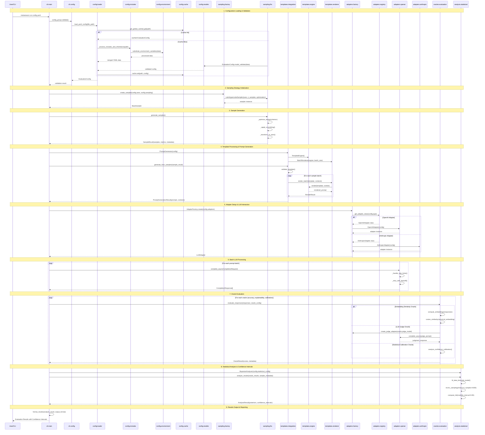

# MetaReason Core: Architecture & Sequence Diagram

## Overview
MetaReason is a statistical evaluation framework for Large Language Models that combines Latin Hypercube Sampling, template-based prompt generation, and multi-oracle evaluation to provide rigorous statistical confidence intervals.

## Core Architecture Flow



## Key Components & Classes

### 1. Configuration System (`metareason.config`)
- **`EvaluationConfig`**: Main configuration model with full validation
- **`ConfigLoader.load_yaml_config()`**: Entry point with caching and includes
- **`IncludeProcessor.process_includes_and_inheritance()`**: YAML composition
- **`EnvironmentSubstitutionEngine.substitute_variables()`**: Env var handling
- **`GlobalCache.get()/set()`**: Configuration caching with TTL

### 2. Sampling System (`metareason.sampling`)
- **`SamplerFactory.create_sampler()`**: Factory for different sampling strategies
- **`LatinHypercubeSampler`**: Core LHS implementation with optimization
  - `generate_samples() -> SampleResult`
  - `_optimize_design(criterion: str)` (maximin, centermaximin, correlation)
  - `_apply_scrambling()` for enhanced space-filling
- **`SampleResult`**: Container for samples + metadata + quality metrics

### 3. Template System (`metareason.templates`)
- **`PromptGenerator`**: High-level orchestrator
- **`TemplateEngine`**: Jinja2 wrapper with custom filters
- **`BatchRenderer`**: Parallel template rendering
- **`TemplateValidator`**: Template validation with variable checking
- **`RenderResult`**: Batch rendering results with success rates

### 4. Adapter System (`metareason.adapters`)
- **`AdapterRegistry`**: Plugin registry with lazy loading
- **`AdapterFactory.create()`**: Factory with configuration mapping
- **`LLMAdapter`** (abstract): Base interface
  - `complete_async(request: CompletionRequest) -> CompletionResponse`
  - `stream_async()` for streaming responses
- **`BaseHTTPAdapter`**: HTTP client with rate limiting and retries
- **`OpenAIAdapter`**: OpenAI API implementation
- **`AnthropicAdapter`**: Anthropic Claude API implementation

### 5. Oracle System (`metareason.oracles`)
- **`OracleEvaluator`**: Multi-oracle coordinator
- **`EmbeddingSimilarityOracle`**: Semantic similarity scoring
- **`LLMJudgeOracle`**: LLM-as-judge evaluation
- **`StatisticalCalibrationOracle`**: Confidence calibration analysis

### 6. Statistical Analysis (`metareason.analysis`)
- **`BayesianAnalyzer`**: PyMC-based Bayesian inference
- **`BetaBinomialModel`**: Success rate modeling with uncertainty
- **`MCMCSampler`**: Posterior sampling with diagnostics
- **`ConfidenceIntervalCalculator`**: HDI and credible intervals

## Key Design Patterns

### 1. **Plugin Architecture**
```python
# Adapter registration and discovery
@register_adapter("custom_provider")
class CustomAdapter(LLMAdapter):
    async def complete_async(self, request: CompletionRequest) -> CompletionResponse:
        # Custom implementation
```

### 2. **Factory Pattern**
```python
# Flexible object creation based on configuration
sampler = SamplerFactory.create(axes, sampling_config)
adapter = AdapterFactory.create(adapter_config)
```

### 3. **Async-First Design**
```python
# All LLM operations are async for performance
responses = await asyncio.gather(*[
    adapter.complete_async(request) for request in batch
])
```

### 4. **Configuration-Driven Workflow**
```python
# Everything configured via YAML with Pydantic validation
config = load_yaml_config("evaluation.yaml")
# Automatic validation, includes, environment substitution
```

### 5. **Caching Strategy**
```python
# Multi-level caching for performance
config = cache.get(path) or load_and_cache(path)
samples = cache.get(sample_key) or generate_and_cache(axes)
```

## Data Flow Summary

1. **Configuration** → YAML → includes/env vars → validation → `EvaluationConfig`
2. **Sampling** → axes definition → LHS → optimization → `SampleResult`
3. **Templates** → Jinja2 + samples → batch rendering → prompts
4. **LLM Calls** → adapters + rate limiting → async batching → responses
5. **Oracles** → multiple evaluation criteria → scoring → `OracleResult[]`
6. **Analysis** → Bayesian modeling → MCMC → confidence intervals
7. **Output** → structured results → console/JSON/YAML

## Advanced Architecture Insights

### Concurrency & Performance Patterns

**Async Batch Processing**
```python
# Parallel LLM calls with rate limiting
async with adapter.rate_limiter:
    tasks = [adapter.complete_async(req) for req in batch]
    responses = await asyncio.gather(*tasks, return_exceptions=True)
```

**Template Rendering Pipeline**
```python
# Multi-threaded template rendering
renderer = BatchRenderer(engine, batch_size=100, max_workers=4)
render_result = await renderer.render_batch(template, contexts)
```

### Error Handling & Resilience

**Retry with Exponential Backoff**
```python
@retry(stop=stop_after_attempt(3), wait=wait_exponential(multiplier=2))
async def _make_request(self, request: CompletionRequest):
    # HTTP request with automatic retry
```

**Graceful Degradation**
```python
# Fallback mechanisms at multiple levels
try:
    data = process_includes_and_inheritance(path)
except Exception:
    data = standard_yaml_load(path)  # Fallback
```

### Memory & Resource Management

**Streaming for Large Datasets**
```python
async def stream_completions(self, requests: Iterator[CompletionRequest]):
    async for request in requests:
        yield await self.complete_async(request)
```

**Smart Caching with TTL**
```python
@lru_cache(maxsize=256, ttl=3600)  # 1-hour TTL
def cached_embedding(text: str) -> np.ndarray:
    return compute_embedding(text)
```

### Configuration Composition Patterns

**Include System with Inheritance**
```yaml
# base_config.yaml
base_sampling: &default_sampling
  method: latin_hypercube
  optimization_criterion: maximin

# child_config.yaml
sampling:
  <<: *default_sampling
  n_samples: 1000
```

**Environment Variable Integration**
```yaml
adapters:
  primary:
    api_key: ${OPENAI_API_KEY}
    base_url: ${API_BASE_URL:-https://api.openai.com}
```

### Quality Assurance Patterns

**Template Validation Pipeline**
```python
validator = TemplateValidator(level=ValidationLevel.STRICT)
result = validator.validate(template, expected_variables=axes.keys())
if not result.is_valid:
    raise TemplateValidationError(result.errors)
```

**Statistical Quality Metrics**
```python
# Sample quality assessment
metrics = lhs_sampler.compute_quality_metrics()
if metrics.space_filling_efficiency < 0.8:
    logger.warning("Poor space-filling detected")
```

### Extensibility Hooks

**Oracle Plugin System**
```python
@register_oracle("custom_metric")
class CustomOracle(BaseOracle):
    def evaluate(self, responses: List[str]) -> OracleResult:
        # Custom evaluation logic
```

**Custom Filter Registration**
```python
@register_filter("format_scientific")
def scientific_notation(value: float) -> str:
    return f"{value:.2e}"
```

## Key Architectural Strengths

1. **Separation of Concerns**: Each module has a single, well-defined responsibility
2. **Dependency Injection**: Components accept interfaces, enabling easy testing and swapping
3. **Configuration-Driven**: Behavior controlled through declarative YAML, not code changes
4. **Async-First**: Built for high-throughput LLM operations from the ground up
5. **Statistical Rigor**: Proper uncertainty quantification with Bayesian methods
6. **Plugin Architecture**: Extensible without modifying core codebase
7. **Comprehensive Error Handling**: Graceful failure modes with detailed diagnostics
8. **Performance Optimized**: Multi-level caching, batching, and parallel processing

This architecture enables reproducible, statistically rigorous LLM evaluation with comprehensive configuration management and extensible plugin systems.
